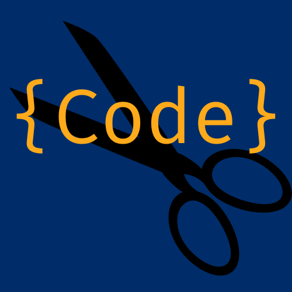

# SnippetHub

Sharing Code in a Snip of Time




## Table of Contents

- [About](#about)
- [Features](#features)
- [Getting Started](#getting-started)
  - [Prerequisites](#prerequisites)
  - [Installation](#installation)
- [Usage](#usage)
- [Contributing](#contributing)
- [License](#license)
- [Contact](#contact)
---

## About

SnippetHub is a web application designed to help developers store, manage, and share code snippets easily. Whether you're working on a personal project or collaborating with a team, SnippetHub streamlines the process of organizing and accessing code snippets, making your development workflow more efficient.

With SnippetHub, you can:

- Create and store code snippets for various programming languages and frameworks.
- Organize snippets using tags and categories for quick retrieval.
- Share snippets with others by generating shareable links.
- Collaborate with team members by creating private snippet collections.

Boost your productivity and coding efficiency with SnippetHub – your centralized hub for code snippets!

## Features

- **Code Snippet Management:** Store and manage your code snippets in a user-friendly interface.
- **Tagging and Categorization:** Organize your snippets efficiently by adding tags and categorizing them based on programming languages, frameworks, or use cases.
- **Search and Filter:** Easily find specific snippets using powerful search and filter options, saving you time and effort.
- **Private Collections:** Create private collections of snippets for team collaboration or personal reference, ensuring your sensitive code remains secure.
- **User Profiles:** Customize your profile with a personal avatar, bio, and favorite snippets.
- **Responsive Design:** Access SnippetHub from various devices – desktops, tablets, and mobile phones – for a seamless user experience.
- **User Authentication:** Secure your snippets with user authentication, ensuring that only authorized users can access and manage their code snippets.
- **coming soon ~ Syntax Highlighting:** Enjoy syntax highlighting for various programming languages, enhancing the readability of your code snippets.
- **coming soon ~ Snippet Sharing:** Generate shareable links to your snippets, allowing you to easily share your code with colleagues, friends, or the developer community.

## Getting Started

### Prerequisites

Before you begin, make sure you have the following installed:

- Python (3.6 or higher)
- Django
- Pillow
- django-registration-redux

### Installation

1. **Clone the Repository:**

   ```bash
   git clone https://github.com/merrick-vogt/SnippetHub.git

2. **Navigate to the Project Directory**

    cd SnippetHub

3. **Create a Virtual Environment (Optional but Recommended)**
    
    python3 -m venv venv
    source venv/bin/activate

4. **Install Dependencies** 
    
    pip install -r requirements.txt

5. **Apply Migrations**
    
    python manage.py makemigrations
    python manage.py migrate

6. **Create a Superuser**
    
    python manage.py createsuperuser

7. **Run the Development Server** 
    
    python manage.py runserver

8. **Access SnippetHub:**
    
    Open your web browser and navigate to http://127.0.0.1:8000/ to access SnippetHub.

## Usage

Welcome to SnippetHub! This section will guide you through the basic usage of the application. SnippetHub makes it easy to manage, organize, and share your code snippets.

### 1. Create an Account

- Navigate to the registration page and create a new account. If you've run the development server locally, you can typically find the registration page by clicking on the login in button on the home page or using the url: `http://127.0.0.1:8000/accounts/register/`.

### 2. Log In

- Once you have an account, log in using your credentials.

### 3. Dashboard

- Upon logging in, you'll be greeted with your dashboard, where you can manage your code snippets and collections.

### 4. Add a New Snippet

- Click on the "Add Snippet" button to create a new code snippet.
- Provide a title, select the programming language, add tags, select whether the snippet will be public, and paste your code.
- Click "Save" to add the snippet to your collection.

### 5. Organize with Tags and Categories

- Use tags and categories to organize your snippets based on languages, frameworks, or projects.
- Assign tags and categories while adding or editing a snippet.

### 6. Edit and Delete Snippets

- You can edit or delete your snippets at any time by accessing them from your dashboard.

### 7. Explore 

- Explore snippets shared by other users in the community.

### 8. Profile Settings

- Customize your profile by uploading a profile picture and adding a bio.

### 9. coming soon ~ Share Your Snippets

- To share a snippet, open it and click on the "Share" button.
- Copy the generated shareable link and send it to your colleagues or share it on social media.

### 10. coming soon ~ Create Private Collections

- If you're collaborating with a team or want to keep certain snippets private, create a private collection.
- Add snippets to your private collection to keep them secure and accessible only to authorized users.

---

Feel free to explore the features, experiment with different functionalities, and tailor SnippetHub to suit your coding needs. If you encounter any issues or have suggestions for improvements, don't hesitate to get in touch through our contact information provided in the README.

## Contributing

We're thrilled that you're interested in contributing to SnippetHub! Whether you're an experienced developer or just starting out, your ideas and contributions are welcome. 🎉

### How to Contribute

1. Fork the repository to your own GitHub account.
2. Create a new branch from the `main` branch for your work.
3. Make your changes and improvements, ensuring to follow good coding practices.
4. Test your changes locally to make sure everything works as expected.
5. Add clear, concise documentation about your changes.
6. Commit your changes and push them to your forked repository.
7. Open a pull request (PR) against the `main` branch with a descriptive title and detailed explanation of your changes.

### Features to Consider

We believe that collaboration leads to innovation. Here are a few ideas for features you could work on:

1. **Enhanced Search Queries:** Improve the search functionality with full-text search capabilities, allowing users to find snippets more easily.

2. **Snippet Favoriting:** Allow users to mark their favorite snippets for quick access.

3. **User Repositories:** Enable users to create their repositories to organize snippets and collections based on projects or themes.

4. **Follow Other Users:** Implement a follow system to allow users to stay updated on each other's activity.

5. **Comments and Feedback:** Add the ability for users to comment on and provide feedback for snippets.

6. **Dark Mode:** Implement a dark mode theme for a more comfortable coding experience during late hours.

7. **Integration with External APIs:** Integrate with popular code-sharing platforms to import and sync snippets.

8. **Code Metrics:** Provide statistics about snippet usage, popularity, and languages.

Remember, the best contributions come from diverse perspectives, so don't hesitate to share your ideas or work on something that excites you. We appreciate every contribution, big or small!


## Contact

If you are interested in collaborating or learning more about my work, please reach me at merrick.vogt@gmail.com